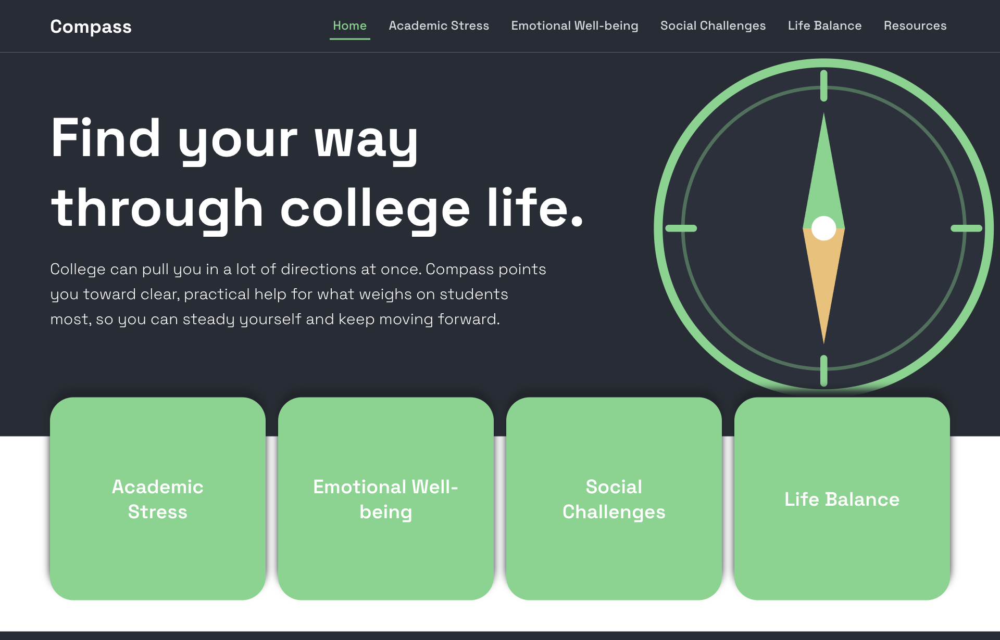
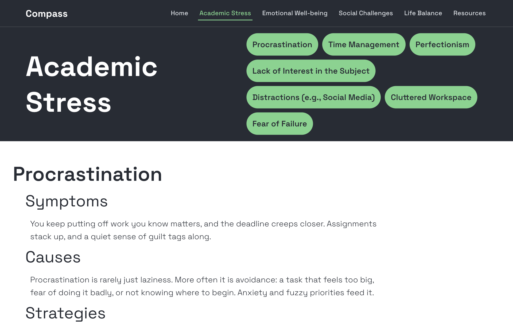

# Compass

**Find your way through college life.**

Compass is a mental-health and well-being resource for college students. It offers clear, grounded, non-clinical guidance for the challenges that weigh on students most, and points toward real help when more support is needed.

Live site: https://jnajera456.github.io/compass



## Overview

College pulls students in many directions at once. Compass organizes practical guidance into four areas, each with common struggles broken down into Symptoms, Causes, Strategies, and Actionable Advice:

- **Academic Stress**: procrastination, time management, perfectionism, focus, and more
- **Emotional Well-being**: anxiety, low mood, overwhelm, homesickness, loneliness, self-esteem
- **Social Challenges**: making friends, roommate conflict, social anxiety, boundaries
- **Life Balance**: priorities, money stress, sleep, physical health, burnout, routines

A **Resources** page surfaces crisis lines (the 988 Suicide and Crisis Lifeline and the Crisis Text Line), and a sitewide note makes clear that Compass is a starting point, not a substitute for professional help.



## Content and sourcing

The guidance is written in a plain, human voice and grounded in general recommendations from reputable organizations, including the National Institute of Mental Health, the American Psychological Association, the Centers for Disease Control and Prevention, and the Jed Foundation. Each content page lists its sources.

Compass is a student project and an informational resource. It is not medical advice.

## Tech stack

- React 18 (Create React App)
- React Router 7
- Plain CSS with a shared component layout
- Jest and React Testing Library

## Getting started

```bash
npm install
npm start      # run the dev server at http://localhost:3000
npm test       # run the test suite
npm run build  # production build
```

## Deployment

The site deploys to GitHub Pages:

```bash
npm run deploy
```

This builds the app, adds an SPA fallback so deep links work, and publishes the `build` folder to the `gh-pages` branch.

## Project structure

```
src/
  components/      Header, Footer, Layout, and the shared TopicPage
  pages/           HomePage, the four category pages, and Resources
  styling-sheets/  Component and page styles
  index.js         App routes
```
